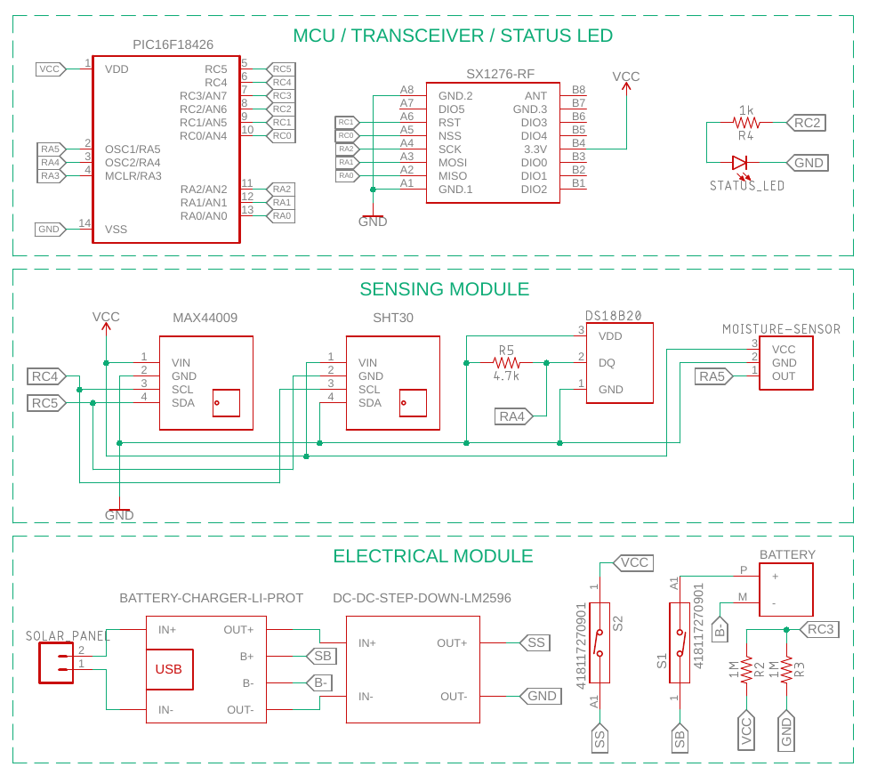
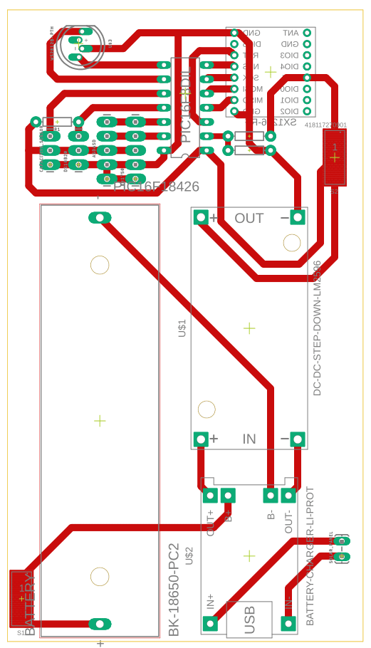
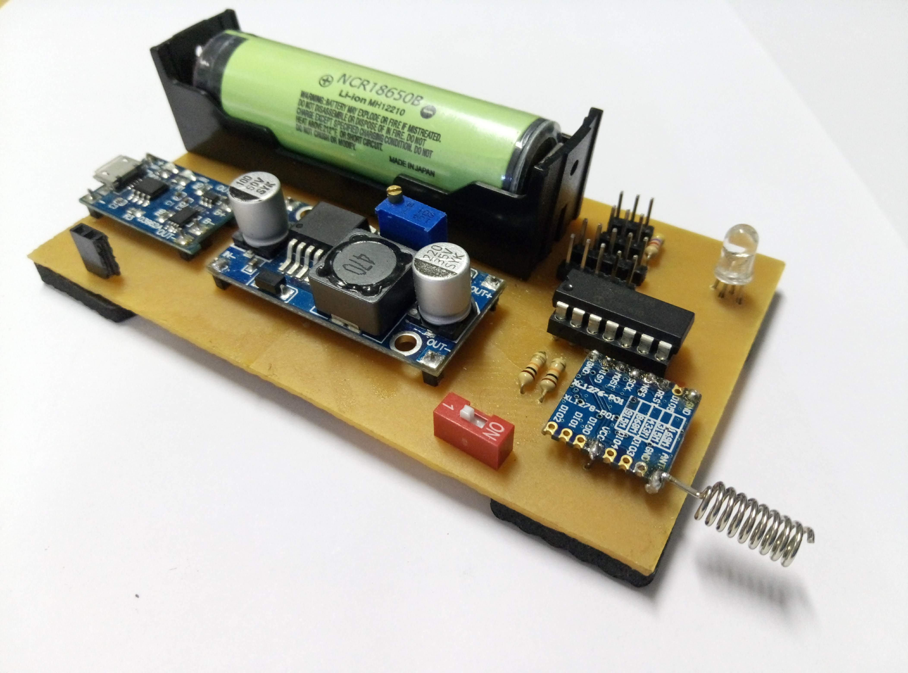
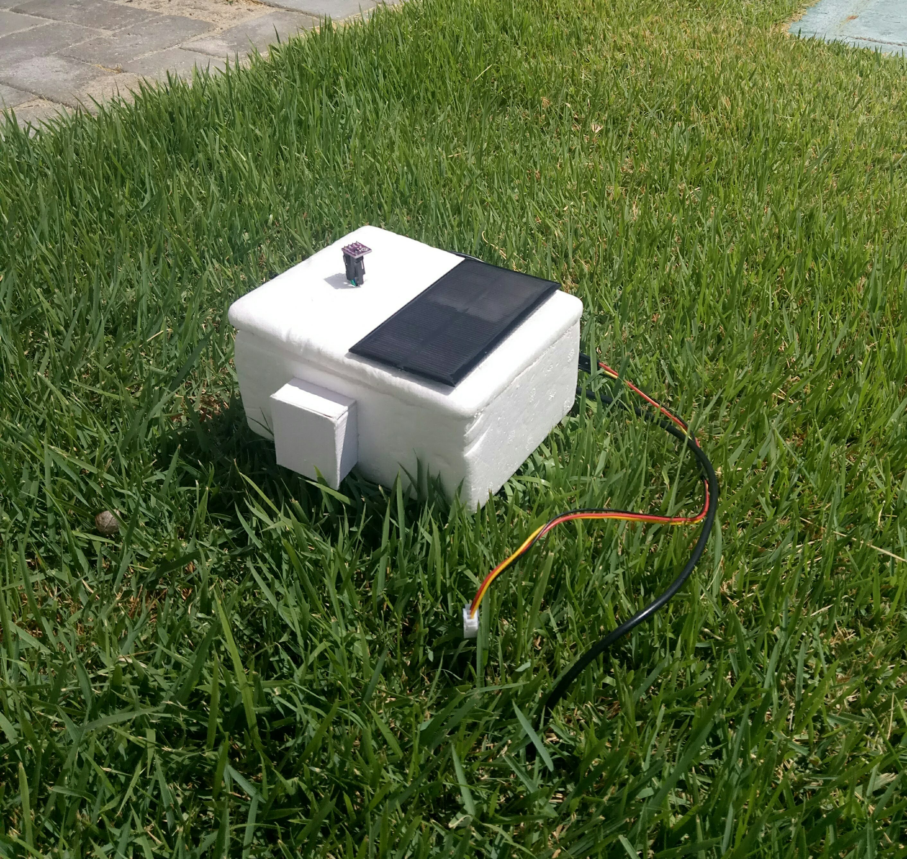
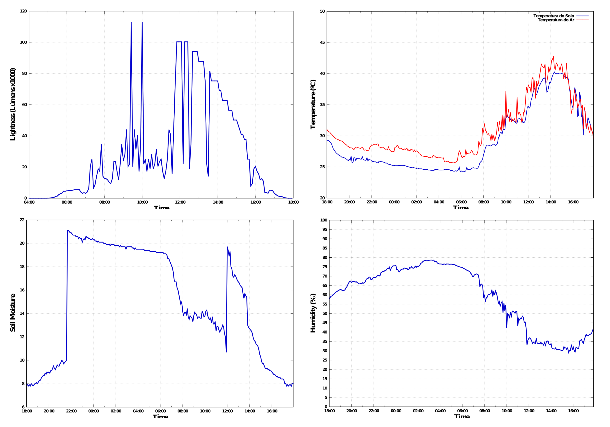

  <h3 align="center">A low cost and low power LoRa device sensor-node</h3>

[![Version][release-shield]][release-url]
[![commits-shield][commits-shield]][commits-url]
[![Stargazers][stars-shield]][stars-url]
![language-shield]
![Size][size-shield]
 
 

     
    <a href="https://github.com/emanuel36/LoRa-sensor-node-device//tree/master/documentation"><strong>:page_facing_up: Explore the documentation :page_facing_up:</strong></a>
     
    <a href="https://github.com/emanuel36/LoRa-sensor-node-device/issues">:warning: Report or Suggest Something :warning:</a>
  

 

  

## Table of Contents

* [About the Project](#about-the-project)
  * [Built With](#built-with)
* [Detailed description](#detailed-description)
  * [Components Specifications](#components-specifications)
  * [Schematic](#schematic)
  * [Board](#board) 
* [Assembled Board With Components](#assembled-board-with-components)
* [Contact](#contact)

## About The Project

This is a project of a new LoRa device sensor-node. This device is capable of collecting environment data such as temperature, humidity, soil moisture and ambient as well as sending all data to a LoRa gateway from miles away. As can be seen from the [component specifications](#components-specifications) table, this device is very inexpensive, therefore it is suitable equipment to apply to a wireless sensor network in an agricultural field.

### Built With
* [LoRa](https://lora-alliance.org/)
* [PIC16F18426](https://www.microchip.com/wwwproducts/en/PIC16F18426)
* [MPLAP X IDE](https://www.microchip.com/mplab/mplab-x-ide)

### IDE and Compiler Version
* [MPLAB XC8 v2.10](https://www.microchip.com/development-tools/pic-and-dspic-downloads-archive)
* [MPLAP X IDE v5.30](https://www.microchip.com/development-tools/pic-and-dspic-downloads-archive)

## Detailed Description
This device is designed to work automatically without any human intervention. 

### Microcontroller
The PIC16F18426 is perfect for the project, it's a family of Microchip MCUs intended to sensor node devices.

### Sensors
The device has 4 sensors to measure air temperature, ground temperature, air humidity, soil moisture and sunlight or light levels.

### LoRa Transmitter
The cheap SX1276 transmitter works well at a frequency of 915 MHz, because I'm using it in Brazil.

### Power Supply System
The electrical and power system is designed for decades of operation, with a combination of a large rechargeable battery and a solar-powered recharge system. It is possible to use this device only with solar energy without battery, the battery is only for power supply when there is no sunlight, such as at night and cloudy days.

### Power-Saving Operation Mode
Most of the time the device remains in power save state with all peripherals turned off. When it is necessary to perform some task the system is woken up by an interruption. The data send and transmit period can be set between 5 and 80 minutes, so the system is woken up by a timer interrupt, performs the tasks and returns to power save mode.

### Status LED
The device can signal its current status through a flashing blue LED when it is operating normally and red when something is wrong such as low battery, sensor reading failure or incorrect sensor data such as 80ºC temperature.

### Components specifications

| Component   | Description/Documentation   | Price (USD)   |
|---------------------------------  |:-----------------------------------------------------------------------------------------------------------------------------------------:  |------------:  |
| Microcontroller   | [PIC16F18426](https://www.microchip.com/wwwproducts/en/PIC16F18426)   | $1,02   |
| LoRa Transmiter   | [SX1276](https://www.semtech.com/products/wireless-rf/lora-transceivers/sx1276) | $4,15   |
| Solar Panel   | [Wavgat solar panel 1W/5V](https://pt.aliexpress.com/item/32844672794.html?isOrigTitle=true)  | $1,31   |
| LED | [RGB LED](https://www.sparkfun.com/datasheets/Components/YSL-R596CR3G4B5C-C10.pdf)  | $0,10 |
| Voltage regulator   | [LM2596](http://www.ti.com/product/LM2596)  | $0,30   |
| Switch   | [DIP Switch 1 way](https://www.we-online.de/katalog/datasheet/418117270901.pdf)  | $0,16 |
| PINS | [Header pin male](https://cdn.sparkfun.com/datasheets/Prototyping/16188.pdf)  | $0,20  |
| MCU Socket | [14-PIN PDIP Socket](https://www.sparkfun.com/products/7939)  | $0,50   |
| 10k Resistors  | [10k Resistors](https://www.circuitspecialists.com/rb10k.html) | $0,12 |
| 4.7k Resistor  | [4.7k Resistors](https://www.circuitspecialists.com/ra4.7k.html) | $0,05 |
| Battery   | [Panasonic NCR18650B](https://www.batteryspace.com/prod-specs/NCR18650B.pdf)  | $4,75   |
| Battery Holder  | [BK-18650-PC2](http://www.memoryprotectiondevices.com/datasheets/BK-18650-PC2-datasheet.pdf)  | $0,49   |
| Light Sensor  | [MAX44009](https://www.maximintegrated.com/en/products/interface/sensor-interface/MAX44009.html)  | $1,55   |
| Air Temperature/Humidity Sensor   | [Sensirion SHT30](https://www.sensirion.com/en/environmental-sensors/humidity-sensors/digital-humidity-sensors-for-various-applications/)   | $1,90   |
| Soil Moisture Sensor  | [Capacitive soil moisture sensor v1.2](https://media.digikey.com/pdf/Data%20Sheets/DFRobot%20PDFs/SEN0193_Web.pdf)  | $0,76   |
| Soil Temperature  | [DS18B20](https://www.maximintegrated.com/en/products/DS18B20)  | $1,00   |
|**Total** |-| **$18,36**|

### Schematic

### Board

## Assembled Board With Components

## System Running

## Data collected

## Acknowledgements

I would like to thank all the professors I've had since elementary school, this project is the result of a combination of everything you taught me.

The SX1276 LoRa transmitter driver was adapted from https://github.com/sandeepmistry/arduino-LoRa.

## Contact

Emanuel Angelim - [Linkedin](https://www.linkedin.com/in/emanuel36/en) - emanuel.tiec@gmail.com

Project Link: [https://github.com/emanuel36/LoRa-sensor-node-device](https://github.com/emanuel36/LoRa-sensor-node-device)

[contributors-shield]: https://img.shields.io/github/contributors/emanuel36/LoRa-sensor-node-device?style=for-the-badge
[commits-shield]:https://img.shields.io/github/last-commit/emanuel36/LoRa-sensor-node-device?style=for-the-badge
[commits-url]:https://github.com/emanuel36/LoRa-sensor-node-device/commits/master
[release-shield]:https://img.shields.io/github/v/release/emanuel36/LoRa-sensor-node-device?style=for-the-badge
[release-url]:https://github.com/emanuel36/LoRa-sensor-node-device/releases
[contributors-url]: https://github.com/emanuel36/LoRa-sensor-node-device/graphs/contributors
[stars-shield]: https://img.shields.io/github/stars/emanuel36/LoRa-sensor-node-device?color=183c0d&style=for-the-badge
[stars-url]: https://github.com/emanuel36/LoRa-sensor-node-device/stargazers
[language-shield]: https://img.shields.io/github/languages/top/emanuel36/LoRa-sensor-node-device?color=191970&style=for-the-badge
[language-url]: https://github.com/emanuel36/LoRa-sensor-node-device/search?l=c
[size-shield]: https://img.shields.io/github/languages/code-size/emanuel36/LoRa-sensor-node-device?color=008080&label=SIZE&style=for-the-badge
[issues-shield]: https://img.shields.io/github/issues/emanuel36/LoRa-sensor-node-device?style=for-the-badge
[issues-url]:https://github.com/emanuel36/LoRa-sensor-node-device/issues
[linkedin-shield]: https://img.shields.io/badge/-LinkedIn-blue?style=for-the-badge
[linkedin-url]: https://www.linkedin.com/in/emanuel36/en
