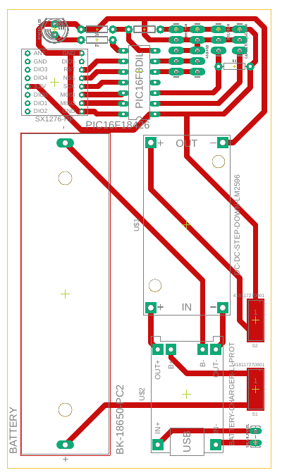

  <h3 align="center">A low cost and low power LoRa device sensor-node</h3>

[![Contributors][contributors-shield]][contributors-url]
[![Stargazers][stars-shield]][stars-url]
![language-shield]
![Size][size-shield]
[![Issues][issues-shield]][issues-url]
[![LinkedIn][linkedin-shield]][linkedin-url]
 
 
 

   :construction: Still in progress :construction:
     
    <a href="https://github.com/emanuel36/LoRaWAN-sensor-node-device//tree/master/documentation"><strong>:page_facing_up: Explore the documentation :page_facing_up:</strong></a>
     
    <a href="https://github.com/emanuel36/LoRaWAN-sensor-node-device/issues">:warning: Report or Suggest Something :warning:</a>
  

 

  

## Table of Contents

* [About the Project](#about-the-project)
  * [Built With](#built-with)
* [Detailed description](#detailed-description)
  * [Components Specifications](#components-specifications)
  * [Schematic](#schematic)
  * [Board](#board) 
* [Assembled Board With Components](#assembled-board-with-components)
* [Contact](#contact)

## About The Project

This is a project of a new LoRa device sensor-node. This device is capable of collecting environment data such as temperature, humidity, soil moisture and ambient as well as sending all data to a LoRaWAN gateway from miles away. The most impressive feature is the extremely low current draw of this device, because each component was analyzed and the low power consumption was one of the most analyzed aspects in the selection process. The electrical and power system is designed for decades of operation, with a combination of a large rechargeable battery and a solar-powered recharge system. In addition to collecting data about the environment, the device can signal its current status through an LED. It is also capable of detecting sensors reading errors and the battery level. This device is designed to work automatically without any human intervention. As can be seen from the [component specifications](#components-specifications) table, this device is very inexpensive, therefore it is suitable equipment to apply to a wireless sensor network in an agricultural field.

### Built With
* [LoRaWAN](https://lora-alliance.org/)
* [PIC16F18426](https://www.microchip.com/wwwproducts/en/PIC16F18426)
* [MPLAP X IDE](https://www.microchip.com/mplab/mplab-x-ide)

### IDE and Compiler Version
* [MPLAB XC8 v1.42](https://www.microchip.com/development-tools/pic-and-dspic-downloads-archive)
* [MPLAP X IDE v5.25](https://www.microchip.com/development-tools/pic-and-dspic-downloads-archive)

## Detailed Description

### Components specifications

| Component   | Description/Documentation   | Price (USD)   |
|---------------------------------  |:-----------------------------------------------------------------------------------------------------------------------------------------:  |------------:  |
| Microcontroller   | [PIC16F18426](https://www.microchip.com/wwwproducts/en/PIC16F18426)   | $1,02   |
| LoRa Transmiter   | [SX1276](https://www.semtech.com/products/wireless-rf/lora-transceivers/sx1276)   | $4,15   |
| Solar Panel   | [Wavgat solar panel 1W/5V](https://pt.aliexpress.com/item/32844672794.html?isOrigTitle=true)  | $1,31   |
| Voltage regulator   | [LM2596](http://www.ti.com/product/LM2596)  | $0,30   |
| Battery   | [Panasonic NCR18650B](https://www.batteryspace.com/prod-specs/NCR18650B.pdf)  | $4,75   |
| Battery Holder  | [BK-18650-PC2](http://www.memoryprotectiondevices.com/datasheets/BK-18650-PC2-datasheet.pdf)  | $0,49   |
| Light Sensor  | [MAX44009](https://www.maximintegrated.com/en/products/interface/sensor-interface/MAX44009.html)  | $1,55   |
| Air Temperature/Humidity Sensor   | [Sensirion SHT30](https://www.sensirion.com/en/environmental-sensors/humidity-sensors/digital-humidity-sensors-for-various-applications/)   | $1,90   |
| Soil Moisture Sensor  | [Capacitive soil moisture sensor v1.2](https://media.digikey.com/pdf/Data%20Sheets/DFRobot%20PDFs/SEN0193_Web.pdf)  | $0,76   |
| Soil Temperature  | [DS18B20](https://www.maximintegrated.com/en/products/DS18B20)  | $1,00   |

### Schematic

### Board

## Assembled Board With Components

## Acknowledgements

## Contact

Emanuel Angelim - [Linkedin](https://www.linkedin.com/in/emanuel36/en) - emanuel.tiec@gmail.com

Project Link: [https://github.com/emanuel36/LoRaWAN-sensor-node-device](https://github.com/emanuel36/LoRaWAN-sensor-node-device)

[contributors-shield]: https://img.shields.io/github/contributors/emanuel36/LoRaWAN-sensor-node-device?style=flat-square
[contributors-url]: https://github.com/emanuel36/LoRaWAN-sensor-node-device/graphs/contributors
[stars-shield]: https://img.shields.io/github/stars/emanuel36/LoRaWAN-sensor-node-device?style=flat-square
[stars-url]: https://github.com/emanuel36/LoRaWAN-sensor-node-device/stargazers
[language-shield]: https://img.shields.io/github/languages/top/emanuel36/LoRaWAN-sensor-node-device?style=flat-square
[language-url]: https://github.com/emanuel36/LoRaWAN-sensor-node-device/search?l=c
[size-shield]: https://img.shields.io/github/languages/code-size/emanuel36/LoRaWAN-sensor-node-device?style=flat-square
[issues-shield]: https://img.shields.io/github/issues/emanuel36/LoRaWAN-sensor-node-device?style=flat-square
[issues-url]:https://github.com/emanuel36/LoRaWAN-sensor-node-device/issues
[linkedin-shield]: https://img.shields.io/badge/-LinkedIn-blue?style=flat-square
[linkedin-url]: https://www.linkedin.com/in/emanuel36/en
